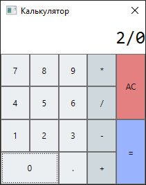
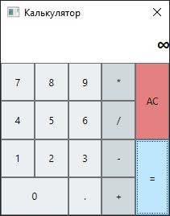
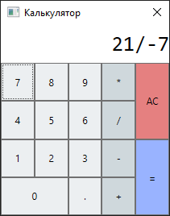
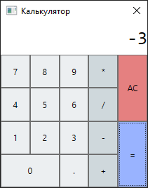
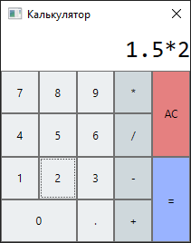
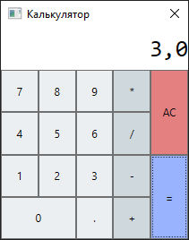

## Unit-Test

Были проверены такие функции как:
- сложение, вычитание, умножение, деление целых и дробных положительных чисел
- сложение, вычитание, умножение, делени целых и дробных отрицатльеных чисел
- деление на ноль

Все фукции работаю корректно

 

**Результат:**  
- деление на ноль  
    

- деление на отрицательное цисло  
    

- дробные числа  
    
