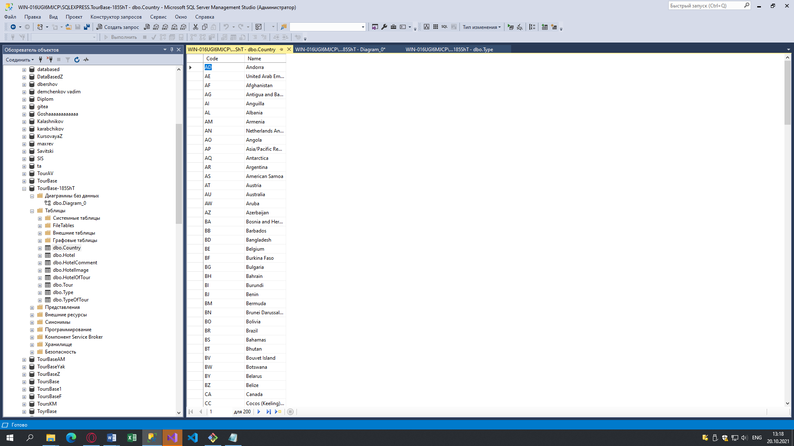

## Глоссарий
**База данных**  
DB (Database), БД. Организованная структура, предназначенная для хранения, изменения и обработки взаимосвязанной информации, преимущественно больших объемов.

 

**ТЗ или Техническое задание**  
Документ, содержащий требования заказчика к объекту закупки, определяющие условия и порядок ее проведения для обеспечения государственных или муниципальных нужд, в соответствии с которым осуществляются поставка товара, выполнение работ, оказание услуг и их приемка.  

 

**Первичный ключ**  
PK, Primary Key. Минимальный набор атрибутов, совокупность значений которых однозначно определяет кортеж в отношении.  

 

**Внешний ключ**  
FK, Foreign Key. Столбец или комбинация столбцов, значения которых соответствуют Первичному ключу в другой таблице.  

 

**SQL**  
Structured Query Language (язык структурированных запросов). Декларативный язык программирования, применяемый для создания, модификации и управления данными в реляционной базе данных, управляемой соответствующей системой управления базами данных.  
 
